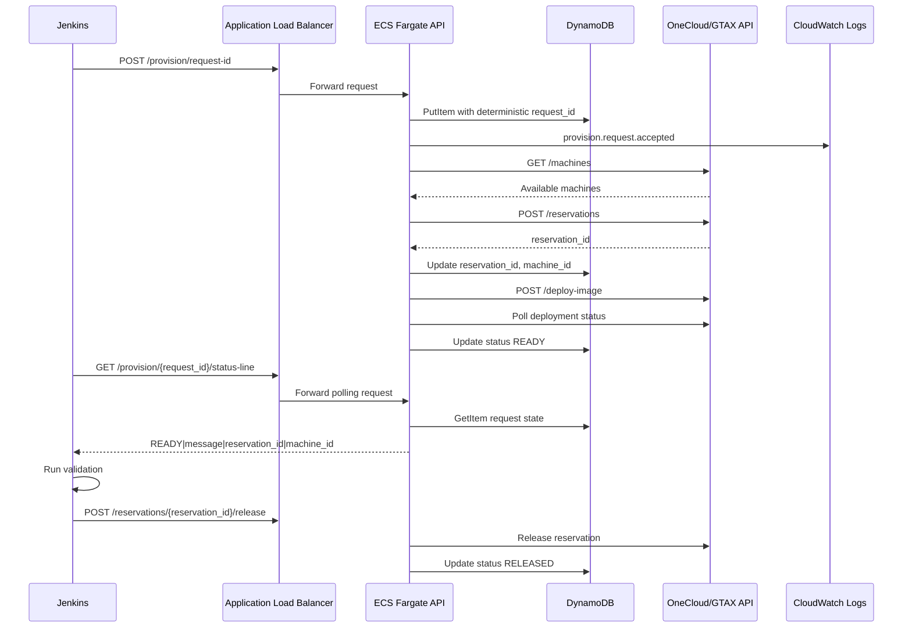
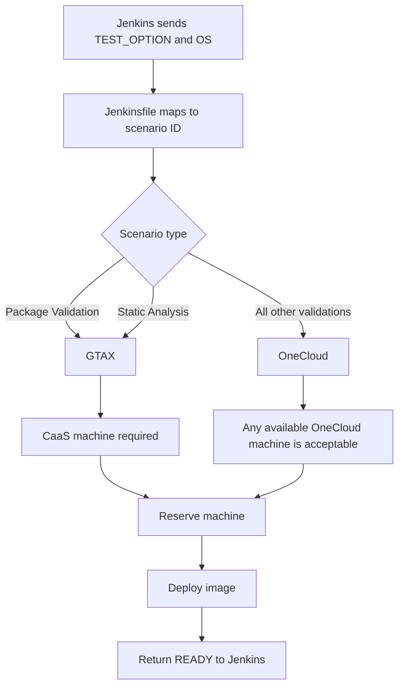
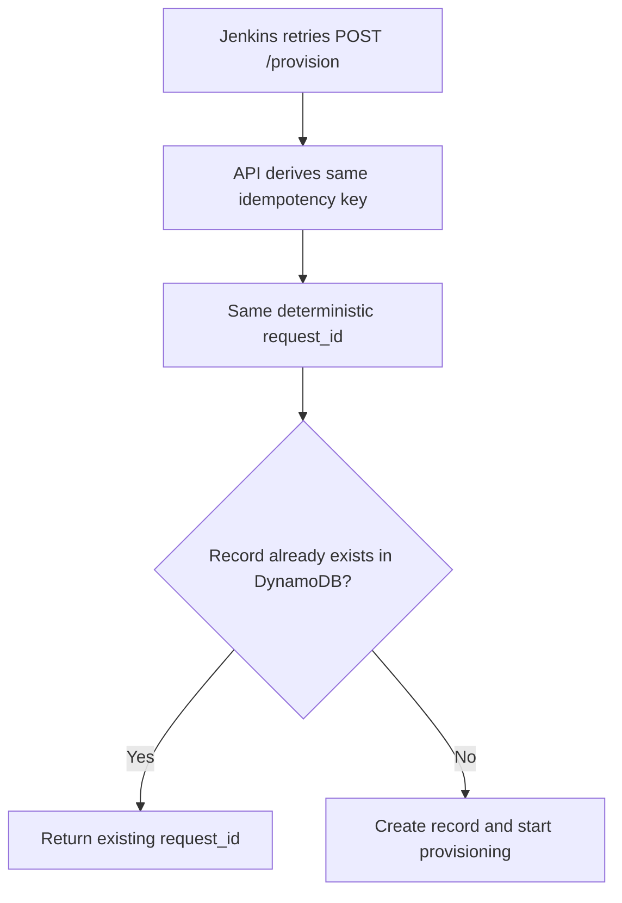

# Internal Provisioning API - Production Deployment Interview Notes

These notes summarize the production deployment work done for the Jenkins-facing Internal Provisioning API. They include the architecture, deployment steps, key design choices, mistakes encountered, and how each issue was debugged and fixed.

## 1. Final Production Architecture

The middleware API was moved from a manually managed EC2-style deployment toward a production container architecture using AWS ECS Fargate.


### Architecture Summary

```text
Jenkins Pipeline
  -> Application Load Balancer
    -> ECS Fargate Service
      -> Internal Provisioning API container
        -> DynamoDB for provisioning state
        -> OneCloud dummy API for normal VM/hardware scenarios
        -> GTAX dummy API for CaaS scenarios
        -> CloudWatch Logs for structured logs
```

### Production Components

```text
Container image registry: AWS ECR private repository
Container runtime: ECS Fargate
Scaling: ECS Service Auto Scaling using Application Auto Scaling
Public entry point: Application Load Balancer
State store: DynamoDB
Logs: CloudWatch Logs
IAM execution role: ecsTaskExecutionRole
IAM app task role: internalProvisioningApiAppTaskRole
Provider APIs: Dummy OneCloud and GTAX services
Jenkins URL: ALB DNS name
```

### Current API Endpoint

```text
http://provisioning-api-alb-721748721.ap-south-1.elb.amazonaws.com
```

Health check:

```text
http://provisioning-api-alb-721748721.ap-south-1.elb.amazonaws.com/health
```

## 2. Why Containerize The Middleware API?

Initially, the API could run directly on EC2 using Python and systemd. For production design, the better direction was containerization.

### Reasons

```text
1. Repeatable runtime environment
2. No manual server dependency drift
3. Easy rollback by changing ECS task definition revision
4. Works naturally with ECR and ECS Fargate
5. Easier horizontal scaling
6. Logs go directly from container stdout to CloudWatch
7. ECS replaces failed containers automatically
```

### Interview Explanation

```text
I containerized the middleware API because it is a standalone broker service.
The API itself should be stateless at the container layer, while provisioning
state is stored externally in DynamoDB. This lets ECS Fargate run and replace
containers without losing request state.
```

## 3. Application Changes Made For Production

The application was updated before deployment to make it production-ready.

### Structured Logging

The FastAPI app now writes JSON logs to stdout.

Important log fields:

```text
request_id
idempotency_key
jenkins_build_id
test_scenario
team
status
provider
reservation_id
machine_id
image
status_message
failure_reason
```

Important events:

```text
provision.request.accepted
provision.request.reused
scenario.resolved
machine.selected
reservation.created
image.deployment.started
provision.status.updated
release.requested
release.completed
release.failed
```

### Idempotency

The API supports an optional HTTP header:

```text
Idempotency-Key
```

If Jenkins does not provide the header, the API derives one from:

```text
team + jenkins_build_id + test_scenario
```

Example derived key:

```text
jenkins:oneapi:7:dpcpp-adl-win11-validation
```

The API derives a deterministic `request_id` from the idempotency key. This means duplicate Jenkins retries return the same request instead of reserving multiple machines.

### DynamoDB Store

The app supports:

```text
PROVISION_STORE=memory
PROVISION_STORE=dynamodb
```

Local/demo mode can use memory. Production mode uses DynamoDB.

Expected DynamoDB table:

```text
Table name: internal-provisioning-requests
Partition key: request_id String
GSI: reservation_id-index
GSI partition key: reservation_id String
Billing mode: On-demand / PAY_PER_REQUEST
```

### App Environment Variables

```text
PROVISION_STORE=dynamodb
PROVISION_DYNAMODB_TABLE=internal-provisioning-requests
PROVISION_DYNAMODB_RESERVATION_ID_INDEX=reservation_id-index
ONECLOUD_BASE_URL=https://dummy-onecloud-api.onrender.com
GTAX_BASE_URL=https://dummy-gtax-api.onrender.com
LOG_LEVEL=INFO
```

## 4. Request Lifecycle



## 5. Provider Selection Logic



### Policy

```text
Package Validation -> GTAX CaaS
Static Analysis    -> GTAX CaaS
Everything else    -> OneCloud
```

The API only provisions infrastructure. Jenkins runs the actual validation workload.

## 6. Docker Implementation

Added:

```text
Dockerfile
.dockerignore
```

Dockerfile behavior:

```text
Base image: python:3.12-slim
Working directory: /app
Install requirements.txt
Copy app.py
Run as non-root app user
Expose port 8080
Run uvicorn on 0.0.0.0:8080
Healthcheck: GET /health
```

Local build command:

```powershell
cd "C:\Users\tusha\OneDrive\Documents\API intel\repos\internal-provisioning-api"
docker build -t internal-provisioning-api .
```

Local run command:

```powershell
docker run --rm -p 8080:8080 internal-provisioning-api
```

Local health check:

```powershell
curl http://localhost:8080/health
```

## 7. ECR Deployment Steps

The image was pushed to a private ECR repository.

### Why Private ECR?

```text
1. This is an internal middleware API
2. The image should not be public
3. ECS can pull private ECR images through IAM
4. This is the standard production pattern
```

### PowerShell Commands Used

```powershell
cd "C:\Users\tusha\OneDrive\Documents\API intel\repos\internal-provisioning-api"
```

```powershell
$REGION="ap-south-1"
$REPO="internal-provisioning-api"
$ACCOUNT_ID=(aws sts get-caller-identity --query Account --output text)
$ECR_URI="$ACCOUNT_ID.dkr.ecr.$REGION.amazonaws.com/$REPO"
```

Create ECR repo:

```powershell
aws ecr create-repository --repository-name $REPO --region $REGION
```

Login Docker to ECR:

```powershell
aws ecr get-login-password --region $REGION | docker login --username AWS --password-stdin "$ACCOUNT_ID.dkr.ecr.$REGION.amazonaws.com"
```

Build:

```powershell
docker build -t $REPO .
```

Tag:

```powershell
docker tag "$REPO`:latest" "$ECR_URI`:latest"
```

Push:

```powershell
docker push "$ECR_URI`:latest"
```

Verify:

```powershell
aws ecr describe-images --repository-name $REPO --region $REGION
```

## 8. DynamoDB Setup

DynamoDB stores request state so ECS containers stay stateless.

### Table Design

```text
Table name: internal-provisioning-requests
Partition key: request_id String
GSI name: reservation_id-index
GSI partition key: reservation_id String
Billing mode: PAY_PER_REQUEST
Region: ap-south-1
```

### Why DynamoDB?

```text
1. Fast key-value lookups by request_id
2. Simple writes for status updates
3. Conditional writes support idempotency
4. Serverless, low operational overhead
5. Works well for provisioning request tracking
```

### State Stored

```text
request_id
idempotency_key
test_scenario
team
jenkins_build_id
status
message
provider
reservation_id
machine_id
image
failure_reason
created_at
updated_at
expires_at
```

## 9. ECS Task Definition

The ECS task definition describes how to run the container.

### Key Settings

```text
Family: internal-provisioning-api
Launch type: Fargate
CPU: 0.5 vCPU
Memory: 1 GB
Container name: internal-provisioning-api
Container port: 8080
Image: private ECR image
Log driver: awslogs
Log group: /ecs/internal-provisioning-api
```

### Roles

There are two different ECS roles.

```text
Task execution role:
ecsTaskExecutionRole
Used by ECS to pull image from ECR and write logs to CloudWatch.
```

```text
Task role:
internalProvisioningApiAppTaskRole
Used by the FastAPI application itself to call DynamoDB.
```

This distinction became important during debugging.

## 10. IAM Role Details

### ECS Task Execution Role

Role name:

```text
ecsTaskExecutionRole
```

Purpose:

```text
Allows ECS to pull from ECR and send logs to CloudWatch.
```

Policy:

```text
AmazonECSTaskExecutionRolePolicy
```

### Application Task Role

Role name:

```text
internalProvisioningApiAppTaskRole
```

Trusted entity:

```text
ecs-tasks.amazonaws.com
```

Inline policy name:

```text
InternalProvisioningDynamoDBAccess
```

Policy:

```json
{
  "Version": "2012-10-17",
  "Statement": [
    {
      "Effect": "Allow",
      "Action": [
        "dynamodb:GetItem",
        "dynamodb:PutItem",
        "dynamodb:UpdateItem",
        "dynamodb:Query",
        "dynamodb:DescribeTable"
      ],
      "Resource": [
        "arn:aws:dynamodb:ap-south-1:<account-id>:table/internal-provisioning-requests",
        "arn:aws:dynamodb:ap-south-1:<account-id>:table/internal-provisioning-requests/index/reservation_id-index"
      ]
    }
  ]
}
```

Important: replace `<account-id>` with the real AWS account ID.

## 11. ECS Service And ALB

The ECS service keeps the Fargate task running.

### Service

```text
Cluster: internal-provisioning-cluster
Service: internal-provisioning-api-service
Initial desired tasks: 1
Launch type: Fargate
Task definition: internal-provisioning-api latest revision
```

### Service Auto Scaling

The project uses ECS Service Auto Scaling, not an EC2 Auto Scaling Group.

```text
Fargate manages the underlying compute.
Application Auto Scaling changes the ECS service desired task count.
Terraform creates the scalable target and target tracking policies.
```

Current default scaling configuration:

```text
Minimum tasks: 1
Maximum tasks: 3
CPU target: 70 percent average utilization
Memory target: 75 percent average utilization
Scale out cooldown: 60 seconds
Scale in cooldown: 120 seconds
```

The GitHub Terraform workflow can override these through repository variables:

```text
TF_VAR_AUTOSCALING_MIN_CAPACITY
TF_VAR_AUTOSCALING_MAX_CAPACITY
TF_VAR_AUTOSCALING_CPU_TARGET
TF_VAR_AUTOSCALING_MEMORY_TARGET
```

Terraform also ignores drift on `desired_count` so that after AWS scales the service, the next Terraform apply does not reset the running task count.

Interview wording:

```text
Because the service runs on Fargate, I do not manage EC2 Auto Scaling Groups.
The production design uses ECS Service Auto Scaling. AWS scales the number of
Fargate tasks based on CPU and memory target tracking policies.
```

### Load Balancer

```text
Type: Application Load Balancer
Name: provisioning-api-alb
Listener: HTTP 80
Target group protocol: HTTP
Target group port: 8080
Target type: IP
Health check path: /health
```

### Why ALB?

```text
1. Provides a stable public endpoint for Jenkins
2. Routes only to healthy ECS tasks
3. Allows future HTTPS with ACM certificate
4. Supports multiple tasks if service scales horizontally
```

## 12. CloudWatch Logging

The API writes JSON logs to stdout. ECS sends container logs to CloudWatch.

### Log Group

```text
/ecs/internal-provisioning-api
```

### Where To Check

```text
CloudWatch > Logs > Log groups > /ecs/internal-provisioning-api
```

Log stream format:

```text
api/internal-provisioning-api/<task-id>
```

### Why Logging Matters

```text
1. Every Jenkins build can be traced by jenkins_build_id
2. Every provisioning request can be traced by request_id
3. Failures show provider, machine, reservation, and reason
4. CloudWatch provides centralized logs across container restarts
5. Logs are critical when Jenkins only shows a generic HTTP 500
```

## 13. Jenkins Integration

Jenkins uses the ALB URL as the API base URL.

```text
PROVISION_API=http://provisioning-api-alb-721748721.ap-south-1.elb.amazonaws.com
```

Jenkins calls:

```text
POST /provision/request-id
GET /provision/{request_id}/status-line
POST /reservations/{reservation_id}/release
```

The Jenkins pipeline runs validation itself after the API reports `READY`.

### Responsibility Split

```text
API responsibilities:
1. Select provider
2. Discover machine
3. Reserve machine
4. Deploy validation image
5. Track status
6. Release reservation when called
```

```text
Jenkins responsibilities:
1. Resolve test scenario
2. Call provisioning API
3. Poll until READY
4. Run actual validation
5. Publish results
6. Always release reservation in cleanup
```

## 14. Terraform / Infrastructure As Code

The production infrastructure can be managed through Terraform instead of manual AWS Console steps.

### Why Terraform Is Needed In This Project

This project is not only a Python API. The production service depends on multiple AWS resources that must work together:

```text
ECR repository
ECS Fargate cluster
ECS task definition
ECS service
Application Load Balancer
Target group
Security groups
IAM execution role
IAM task role
DynamoDB table
CloudWatch log group
```

If these are created manually, the environment is hard to reproduce and easy to misconfigure. Terraform makes the infrastructure:

```text
1. Version controlled
2. Reviewable through pull requests
3. Reproducible across dev/stage/prod
4. Easier to recover if resources are deleted
5. Less prone to manual console drift
6. Safer because terraform plan previews changes before apply
```

### Terraform Files Added

Terraform was added under:

```text
terraform/
```

Files:

```text
terraform/versions.tf
terraform/variables.tf
terraform/main.tf
terraform/outputs.tf
terraform/terraform.tfvars.example
terraform/README.md
```

### What Terraform Manages

```text
1. Private ECR repository for the middleware image
2. DynamoDB table internal-provisioning-requests
3. DynamoDB GSI reservation_id-index
4. CloudWatch log group /ecs/internal-provisioning-api
5. ECS task execution role
6. ECS application task role with DynamoDB permissions
7. ECS Fargate cluster
8. ECS task definition with production environment variables
9. ECS service
10. ALB security group
11. ECS service security group
12. Application Load Balancer
13. ALB listener on HTTP 80
14. Target group on container port 8080
15. Health check path /health
```

### Terraform Variables Needed

The main values that must be supplied are:

```text
vpc_id
alb_subnet_ids
service_subnet_ids
onecloud_base_url
gtax_base_url
container_image or image_tag
```

For the current setup, public subnets and `assign_public_ip = true` can work.

For stricter production:

```text
ALB -> public subnets
ECS tasks -> private subnets
assign_public_ip = false
Outbound provider access -> NAT Gateway
```

### Terraform And Docker Image Flow

Terraform manages infrastructure, but the Docker image is usually built and pushed by CI/CD.

Production flow:

```text
1. Developer pushes code
2. CI builds Docker image
3. CI pushes image to ECR
4. Terraform creates/updates AWS infrastructure
5. ECS runs the task definition using the ECR image
6. Jenkins calls the ALB URL
```

### Terraform Commands

```powershell
cd "C:\Users\tusha\OneDrive\Documents\API intel\repos\internal-provisioning-api\terraform"
```

Copy the example variables:

```powershell
Copy-Item terraform.tfvars.example terraform.tfvars
```

Initialize:

```powershell
terraform init
```

Preview:

```powershell
terraform plan -var-file="terraform.tfvars"
```

Apply:

```powershell
terraform apply -var-file="terraform.tfvars"
```

Get Jenkins API URL:

```powershell
terraform output -raw api_base_url
```

### Existing Console Resources

Since some resources were already created through AWS Console, there are two production-safe options:

```text
Option 1:
Import existing AWS resources into Terraform state.

Option 2:
Create a clean environment fully through Terraform and migrate Jenkins to the new ALB URL.
```

Do not blindly run Terraform against manually created resources with the same names without importing or planning carefully.

Example imports:

```powershell
terraform import aws_ecr_repository.api internal-provisioning-api
terraform import aws_dynamodb_table.provisioning_requests internal-provisioning-requests
```

### Interview Explanation

```text
For production, I would manage this infrastructure with Terraform because the
API depends on ECS Fargate, ECR, DynamoDB, CloudWatch, IAM, ALB, target groups,
and security groups. Manual setup is acceptable for initial validation, but it
creates drift and makes recovery difficult. Terraform makes the platform
reproducible, reviewable, and auditable, and terraform plan lets the team see
infrastructure changes before they are applied.
```

## 15. Mistakes And Debugging Story

These are useful to mention in an interview because they show practical debugging.

### Mistake 1: Docker Build From Wrong Directory

Command was run from:

```text
C:\Users\tusha
```

Error:

```text
failed to read dockerfile: open Dockerfile: no such file or directory
```

Cause:

```text
Dockerfile was inside the middleware repo, but docker build used the wrong current directory.
```

Fix:

```powershell
cd "C:\Users\tusha\OneDrive\Documents\API intel\repos\internal-provisioning-api"
docker build -t internal-provisioning-api .
```

Interview phrasing:

```text
The Docker build context matters. The dot at the end of docker build means use
the current directory as the build context, so I had to run it from the repo
where the Dockerfile exists.
```

### Mistake 2: ECR Push Failed Due To Docker Auth

Error:

```text
push access denied, repository does not exist or may require authorization:
authorization failed: no basic auth credentials
```

Cause:

```text
Docker was not authenticated to private ECR, or the push URL/account/region did not match.
```

Fix:

```powershell
aws ecr get-login-password --region ap-south-1 | docker login --username AWS --password-stdin "<account-id>.dkr.ecr.ap-south-1.amazonaws.com"
```

Then tag and push again.

Interview phrasing:

```text
ECR is a private registry, so Docker needs a temporary ECR login token from AWS.
The token is piped securely into docker login using --password-stdin.
```

### Mistake 3: ECS Cluster Creation Failed Because Service-Linked Role Was Not Ready

Error:

```text
Unable to assume the service linked role.
Please verify that the ECS service linked role exists.
```

Cause:

```text
ECS requires AWSServiceRoleForECS so the ECS control plane can manage ECS resources.
```

Fix:

```text
Verified IAM role:
/aws-service-role/ecs.amazonaws.com/AWSServiceRoleForECS
```

Then created a plain ECS cluster without extra options.

Interview phrasing:

```text
ECS uses a service-linked role for control-plane operations. The issue was not
application code; it was an AWS account/role prerequisite for ECS.
```

### Mistake 4: Wrong IAM Role Type For App Task Role

A role was created with this description:

```text
Allows ECS to create and manage AWS resources on your behalf.
```

And policy:

```text
AmazonEC2ContainerServiceRole
```

Problem:

```text
That is an ECS service role, not an ECS task role.
```

Correct role:

```text
Trusted service: ecs-tasks.amazonaws.com
Role name: internalProvisioningApiAppTaskRole
```

Interview phrasing:

```text
I learned the difference between the ECS service role, ECS task execution role,
and ECS task role. The application needs the task role, because that is the IAM
identity available inside the running container.
```

### Mistake 5: DynamoDB AccessDenied Because Container Used Execution Role

CloudWatch error:

```text
AccessDeniedException when calling PutItem
User: assumed-role/ecsTaskExecutionRole/... is not authorized to perform dynamodb:PutItem
```

Cause:

```text
The running ECS task was using ecsTaskExecutionRole as the application role.
```

Correct configuration:

```text
Task role: internalProvisioningApiAppTaskRole
Task execution role: ecsTaskExecutionRole
```

Fix:

```text
1. Created the correct ECS task role trusted by ecs-tasks.amazonaws.com
2. Added DynamoDB inline policy
3. Created new ECS task definition revision
4. Updated ECS service to latest task definition revision
5. Forced a new deployment
```

Important lesson:

```text
Changing IAM role alone is not enough for already-running ECS tasks.
The ECS service must deploy a new task definition revision so new tasks launch
with the corrected task role.
```

### Mistake 6: ALB Health URL Initially Not Reachable

Possible causes checked:

```text
1. ALB security group inbound HTTP 80
2. ECS task security group inbound 8080 from ALB
3. Target group health check path /health
4. Running task health status
```

Fix:

```text
Verified ALB DNS and health endpoint:
http://provisioning-api-alb-721748721.ap-south-1.elb.amazonaws.com/health
```

Interview phrasing:

```text
For ALB issues, I checked reachability from outside first, then target group
health, then security group rules between the ALB and ECS task.
```

## 16. Failure Handling Design

### If Jenkins Retries The Same Request



### If Provider Fails

```text
1. API records FAILED or provider-specific failure status
2. failure_reason is stored
3. Jenkins sees failure in polling
4. Jenkins exits validation path
5. Jenkins cleanup still attempts release if reservation_id exists
```

### If Jenkins Fails

```text
Jenkins post/always block calls release endpoint.
```

### If No Machine Was Allocated

```text
No reservation_id exists.
Jenkins cleanup detects no reservation_id and skips release.
```

### If API Goes Down

```text
ECS restarts failed task.
DynamoDB preserves state.
Jenkins retry returns same request_id if idempotency key is the same.
```

### If API Crashes After Provider Reservation But Before Jenkins Receives ID

Production mitigation:

```text
1. Store reservation as soon as it is created
2. Use idempotency so retry returns same request
3. Use provider reservation TTL
4. Add future cleanup worker for orphaned reservations
```

## 17. What Was Completed

```text
1. Middleware API was containerized
2. Docker image built successfully
3. Private ECR repository created
4. Docker image pushed to ECR
5. DynamoDB table created for provisioning state
6. ECS task definition created
7. ECS cluster created
8. ECS Fargate service created
9. Application Load Balancer created
10. Health endpoint worked through ALB
11. CloudWatch logs confirmed
12. Jenkins pointed to ALB endpoint
13. IAM role issue debugged through CloudWatch traceback
14. Terraform infrastructure files added for production IaC
15. ECS Service Auto Scaling added for Fargate task count
```

## 18. What Remains As Production Polish

These are not required for the demo to run, but they are good interview follow-ups.

```text
1. Add HTTPS to ALB using ACM certificate
2. Restrict ECS task security group to only accept traffic from ALB SG
3. Add CloudWatch alarms for ALB 5xx responses
4. Add CloudWatch alarms for ECS task failures
5. Add CloudWatch metric filters for provisioning failures
6. Move provider URLs and future tokens to SSM Parameter Store or Secrets Manager
7. Add scheduled scaling or ALB request-count scaling if traffic patterns require it
8. Add cleanup worker for expired/orphaned reservations
9. Add DynamoDB TTL cleanup using expires_at
10. Add dashboards for provisioning success/failure/latency
11. Configure Terraform remote state in S3 with DynamoDB state locking
```

## 19. Interview-Ready Explanation

```text
I built a Jenkins-facing internal provisioning broker. Jenkins does not directly
talk to individual cloud providers. It calls one middleware API. The API maps
validation scenarios to the right provider, reserves a matching machine, deploys
the required image, and exposes normalized status back to Jenkins.

For production, I containerized the API and deployed it on ECS Fargate behind an
Application Load Balancer. The containers are stateless, while request and
reservation state is stored in DynamoDB. I added idempotency so Jenkins retries
do not create duplicate reservations. Logs are emitted as structured JSON to
stdout and shipped to CloudWatch by ECS.

The AWS infrastructure can be managed through Terraform so ECS, ECR, DynamoDB,
CloudWatch, IAM, ALB, and security groups are version controlled and
reproducible across environments.

The biggest production debugging lesson was IAM separation in ECS. The execution
role is for ECS to pull images and write logs, while the task role is the
application identity used to call DynamoDB. A CloudWatch traceback showed that
the app was using ecsTaskExecutionRole, which caused DynamoDB AccessDenied. I
fixed it by creating the correct task role trusted by ecs-tasks.amazonaws.com,
adding DynamoDB permissions, creating a new task definition revision, and forcing
a new ECS service deployment.
```

## 20. Quick Demo Checklist

Before demo/interview:

```text
1. Open ALB health endpoint
2. Confirm /health returns store=dynamodb
3. Run Jenkins build
4. Confirm Jenkins receives request_id
5. Confirm DynamoDB record appears
6. Confirm Jenkins polls status-line
7. Confirm validation stage starts after READY
8. Confirm release call runs in post/always cleanup
9. Confirm CloudWatch logs show request_id and status transitions
```

Useful URLs:

```text
Health:
http://provisioning-api-alb-721748721.ap-south-1.elb.amazonaws.com/health

Scenarios:
http://provisioning-api-alb-721748721.ap-south-1.elb.amazonaws.com/scenarios

Provider health:
http://provisioning-api-alb-721748721.ap-south-1.elb.amazonaws.com/provider-health
```

## 21. One-Minute Summary

```text
This system is an internal cloud provisioning broker for Jenkins validation
jobs. Jenkins requests a scenario, the middleware selects OneCloud or GTAX,
reserves a machine, deploys the image, and returns status. Jenkins then runs the
actual validation and calls release in cleanup.

The production deployment uses ECS Fargate, ECR, ALB, DynamoDB, IAM roles, and
CloudWatch Logs. Terraform is used as the infrastructure-as-code layer so the
AWS setup is reproducible and reviewable. The API is stateless, idempotent,
observable, and retry-safe for Jenkins-driven workflows.
```
