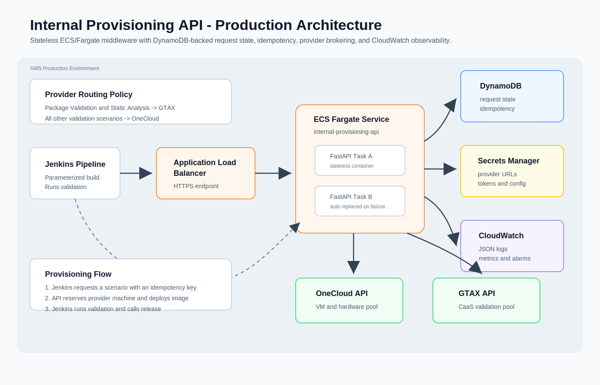

# Internal Provisioning API

Jenkins-facing FastAPI middleware that brokers validation environment provisioning across OneCloud and GTAX-style provider APIs.

Jenkins calls this service with a validation scenario. The middleware resolves the scenario, queries the correct provider API, filters eligible team-tagged machines, creates a reservation, deploys the validation image, tracks normalized status, and exposes a polling endpoint. Once the API reports `READY`, Jenkins owns validation execution and calls the API again when it is time to release the machine.

## Production Architecture



## Endpoints

```text
GET  /health
GET  /provider-health
GET  /scenarios
GET  /machines
POST /provision
POST /provision/request-id
GET  /provision/{request_id}/status
GET  /provision/{request_id}/status-line
POST /reservations/{reservation_id}/release
```

## Environment Variables

```text
ONECLOUD_BASE_URL=https://dummy-onecloud-api.onrender.com
GTAX_BASE_URL=https://dummy-gtax-api.onrender.com
PROVIDER_REQUEST_TIMEOUT_SECONDS=60
PROVISION_POLL_INTERVAL_SECONDS=2
PROVISION_TIMEOUT_SECONDS=300
LOG_LEVEL=INFO
PROVISION_STORE=memory
PROVISION_RECORD_TTL_HOURS=48
PROVISION_DYNAMODB_TABLE=internal-provisioning-requests
PROVISION_DYNAMODB_RESERVATION_ID_INDEX=reservation_id-index
```

For production on ECS/Fargate, set `PROVISION_STORE=dynamodb` and create a DynamoDB table with:

```text
Partition key: request_id (String)
GSI: reservation_id-index with reservation_id (String) as partition key
```

The API derives `request_id` from the idempotency key, then uses a DynamoDB conditional write to prevent duplicate reservations during Jenkins retries. It writes structured JSON logs to stdout so ECS can ship them directly to CloudWatch Logs.

## Local Run

```bash
pip install -r requirements.txt
uvicorn app:app --host 0.0.0.0 --port 8080
```

## Docker Run

Build the middleware API container:

```bash
docker build -t internal-provisioning-api .
```

Run it locally:

```bash
docker run --rm -p 8080:8080 \
  -e PROVISION_STORE=memory \
  -e ONECLOUD_BASE_URL=https://dummy-onecloud-api.onrender.com \
  -e GTAX_BASE_URL=https://dummy-gtax-api.onrender.com \
  internal-provisioning-api
```

Check the container:

```bash
curl http://localhost:8080/health
```

## Example Request

```bash
curl -X POST http://localhost:8080/provision \
  -H "Content-Type: application/json" \
  -d '{"test_scenario":"dpcpp-adl-win11-validation","team":"oneapi","jenkins_build_id":"12345","duration_hours":4}'
```

Then poll:

```bash
curl http://localhost:8080/provision/<request_id>/status
```

## Provider Diagnostics

Check whether the middleware can reach OneCloud and GTAX:

```bash
curl http://localhost:8080/provider-health
```

If one provider is asleep or temporarily unavailable, `/machines` returns a controlled `502` with provider details instead of a raw server error. To return machines from reachable providers only:

```bash
curl "http://localhost:8080/machines?allow_partial=true"
```

## Provisioning Policy

The middleware uses this provider-selection policy:

```text
Package Validation -> GTAX CaaS
Static Analysis    -> GTAX CaaS
All other scenarios -> OneCloud
```

For GTAX CaaS scenarios, the middleware selects an available, clean, team-tagged CaaS machine that supports the requested validation image.

For OneCloud scenarios, the middleware selects any available, clean, team-tagged OneCloud machine. It does not require an exact platform or OS match. If the scenario image is not supported by the selected machine, the middleware uses the first supported image for that machine so the dummy provider can complete deployment.

## Jenkins Parameterized Pipeline

This repo includes a `Jenkinsfile` that shows a parameterized Jenkins pipeline. When you run the job, Jenkins shows options such as:

```text
TEST_OPTION
OS
TEAM
PROVISION_API
DURATION_HOURS
```

The Jenkinsfile maps valid option combinations to provisioning scenarios such as:

```text
DPCPP Compiler Validation + windows-11 -> dpcpp-adl-win11-validation
Package Validation + linux -> package-validation-caas
VM Smoke Validation + ubuntu-24.04 -> oneapi-vm-smoke-validation
```

Unsupported combinations fail early in the `Resolve Scenario` stage.

## Render

```text
Build Command: pip install -r requirements.txt
Start Command: uvicorn app:app --host 0.0.0.0 --port $PORT
Health Check Path: /health
```

Set these environment variables in Render:

```text
ONECLOUD_BASE_URL=<your OneCloud Render URL>
GTAX_BASE_URL=<your GTAX Render URL>
```

## EC2

For EC2 deployment with systemd, see [EC2_DEPLOYMENT.md](EC2_DEPLOYMENT.md).

## Terraform

For production-style AWS infrastructure as code, see [terraform/README.md](terraform/README.md).

## Application Deployment

For the GitHub Actions pipeline that builds the Docker image, pushes it to ECR, and updates ECS without using a local Docker engine, see [deploy/APP_DEPLOYMENT.md](deploy/APP_DEPLOYMENT.md).
